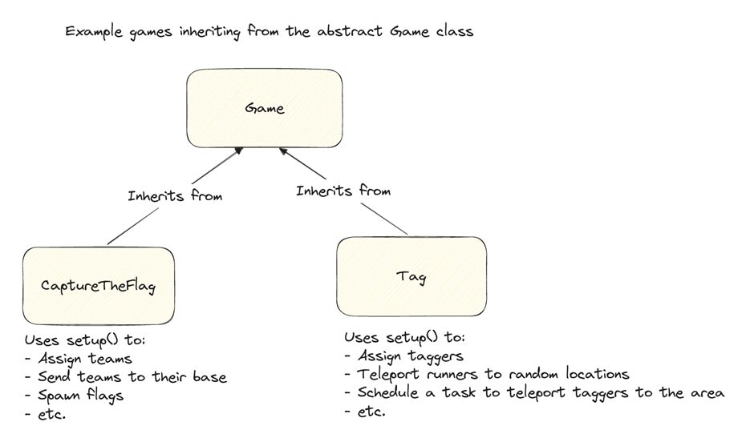

# Game
The functionality contained in the Game module stands at the center of the framework. In here you will find the direct abstractions from which you can start implementing custom game logic.

## Abstract Game
The `Game` class can be used as the 'origin' from which to start developing custom games. the class exposes and implements two methods which can be used to control the game:

* The `start()` method can be called to start running the game. This method in turns calls the `start()` methods of all of the game's components, as well as the `Game` class' protected abstract `setup()` method.
* The `end()` method can be called to terminate the game. Much like the previous method, it calles the `end()` method of each of the game's components, as well as the game's protected abstract `finish()` method.

Now what are these protected abstract methods? Both the `setup()` and `end()` methods are implemented by types which extend the `Game` class, which are the custom games that can be made using the framework. Either of these methods can be used to put the game into its desired state at the given time. 


### Implementing a custom game
In order to start creating a custom game, you can create a class which inherits from `Game`.
```java
public class ExampleGame extends Game {

    @Override
    protected void setup() {
        // This method is called by 'Game.start()'.
        // This method can be used to set up the initial state of the game.
    }

    @Override
    protected void finish() {
        // This method is called by 'Game.end()'.
        // This method can be used to execute the final bits of logic for the game.
    }
}
```

## Game Components
Some logic is useful to certain games, while being useless to other games. Components are used to prevent having to rewrite reusable logic for each game that wants to use it. A component is a class that extends the abstract `GameComponent` class. This class defines two methods: `start()` and `end()`. Both of these methods return a `boolean` which states whether the operation was successful. The `GameComponent` class already implements these methods to simple return `true`, however, these methods can be overridden in sub classes so to execute mpre sophisticated logic. An example would be the `ArenaComponent` which checks whether all the required locations are set:
```java
public class ArenaComponent extends GameComponent {

    // Code omitted.

    @Override
    public boolean start() {
        return hasAllRequiredLocationsSet();
    }

    // Checks whether the arena contains all the locations that are required for the game to run.
    private boolean hasAllRequiredLocationsSet() {
        // Code omitted.
    }

    // Code omitted.
}
```
Recall how `Game.start()` calls the game's components' `start()` method? If the game made use of an `ArenaComponent` which did not have all the required locations set, the game would fail to start. It would only be able to start when all the components are in the correct state and return `true` for their start method. The same goes for the `end()` method, of course.

### The ComponentManager
TOOOOOOOOOOOOOOOOOOO DOOOOOOOOOOOOOOOOOOOOOOOOOOOOOOOOOOOOOOOOOOOOOOOOOOOOOOOOOOOOOOOOOOOOOOOOOOOOO

### Creating custom components
To create your own component, simple create a class which extends the `GameComponent` class.
```java
public class ExampleComponent extends GameComponent {

}
```
This Component can now be added to a `ComponentManager` and be used like any other component. \
If you want to add custom logic at the start or the end of the game, you can override `GameComponent.start()` and `GameComponent.end()`.
```java
public class ExampleComponent extends GameComponent {
    // Hypothetical class to keep track of scores
    private ScoreManager scoreManager; 

    @Override
    public boolean start() {
        // Give myself 100 points when the game starts :)
        scoreManager.addScore("TheKap27", 100);

        // Since in this case the state of this component is irrelevant, return true.
        return true;
    }

    @Override
    public boolean end() {
        // Only allow the game to end if I am winning.
        return scoreManager.getTopPlayer().equals("TheKap27");
    }
}
```